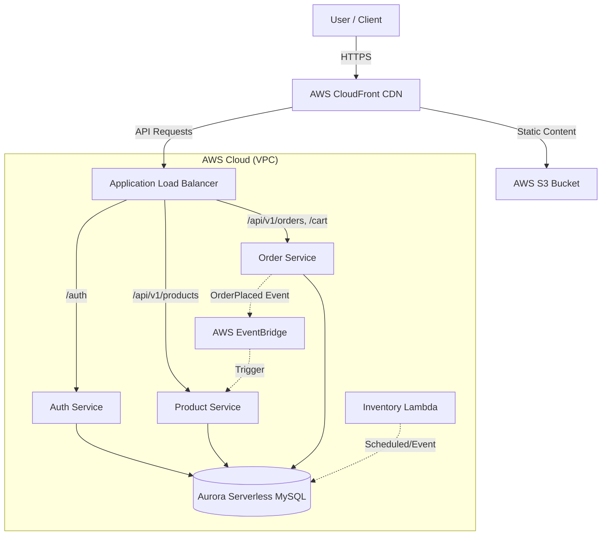
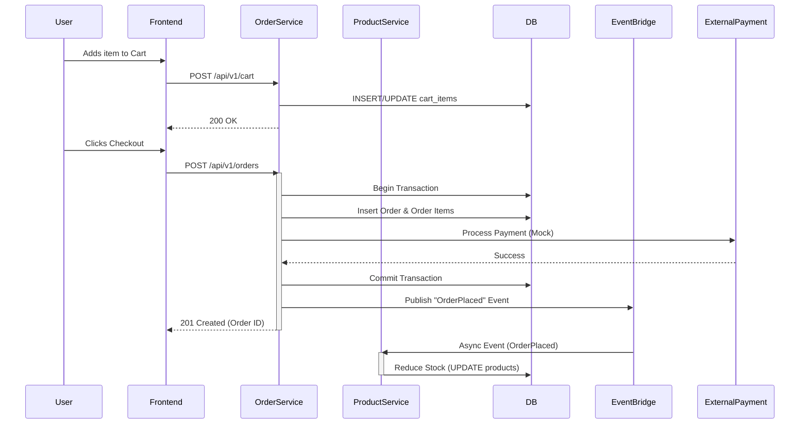

# CloudRetail Architecture Documentation

## 1. System Overview

CloudRetail is a cloud-native e-commerce application built on a microservices architecture. It utilizes AWS managed services for scalability, reliability, and security. The system is composed of decoupled services for Authentication, Products, and Orders, reacting to events asynchronously where appropriate.

### High-Level Architecture

## 2. Cloud Infrastructure (AWS)

The platform leverages the following AWS services:

*   **Compute: Amazon ECS (Fargate)**
    *   Serverless container orchestration for running microservices (`auth`, `product`, `order`, `frontend`).
    *   Autoscaling configured based on CPU/Memory utilization.
*   **Networking: Amazon VPC**
    *   Isolated network environment with Public and Private subnets.
    *   **Application Load Balancer (ALB)**: Distributes traffic to ECS tasks and handles SSL termination.
*   **Database: Amazon Aurora Serverless v2 (MySQL)**
    *   Auto-scaling relational database.
    *   Shared cluster utilized by all microservices (logical separation via schemas/tables).
*   **Storage: Amazon S3**
    *   Hosting static frontend assets (React build).
    *   Storing product images.
*   **Content Delivery: Amazon CloudFront**
    *   CDN for caching static content and edge termination for API requests.
*   **Event Bus: Amazon EventBridge**
    *   Facilitates decoupled, asynchronous communication between services (e.g., stock reduction after order placement).

## 3. Microservices & API Specifications

### 3.1 Auth Service
**Port**: 4001
**Responsibility**: User registration, login, and JWT token issuance.

| Method | Endpoint | Description | Auth Required |
|:---|:---|:---|:---|
| `POST` | `/register` | Register a new user account. | No |
| `POST` | `/login` | Authenticate user and return JWT. | No |

**Data Schema**:
*   `users`: `id`, `first_name`, `last_name`, `email`, `password_hash`, `role`
*   `user_logins`: `id`, `user_id`, `login_time`

---

### 3.2 Product Service
**Port**: 4002
**Responsibility**: Product catalog management, searching, reviews, and wishlist.

| Method | Endpoint | Description | Auth Required |
|:---|:---|:---|:---|
| `GET` | `/api/v1/products` | List/Filter products. | No |
| `GET` | `/api/v1/products/:id` | Get details for a single product. | No |
| `POST` | `/api/v1/products` | Create a new product. | **Yes (Admin)** |
| `GET` | `/api/v1/products/suggestions`| Live search suggestions. | No |
| `POST` | `/api/v1/products/:id/stock` | Manually update stock. | **Yes (Admin)** |
| `GET` | `/api/v1/products/:id/reviews`| Get product reviews. | No |
| `POST` | `/api/v1/products/:id/reviews`| Add a review. | **Yes** |
| `GET` | `/api/v1/wishlist` | Get user's wishlist. | **Yes** |
| `POST` | `/api/v1/wishlist` | Add item to wishlist. | **Yes** |
| `DELETE`| `/api/v1/wishlist/:productId`| Remove item from wishlist. | **Yes** |

**Data Schema**:
*   `products`: `id`, `name`, `description`, `price`, `category`, `brand`, `quantity`, `image_url`
*   `product_images`: `id`, `product_id`, `image_url`, `is_primary`
*   `reviews`: `id`, `product_id`, `user_id`, `rating`, `comment`
*   `wishlist`: `user_id`, `product_id`, `created_at`
*   `stock_history`: `product_id`, `quantity_added`, `added_by`

---

### 3.3 Order Service
**Port**: 4004
**Responsibility**: Cart management, order placement, and order tracking.

#### Order Management
| Method | Endpoint | Description | Auth Required |
|:---|:---|:---|:---|
| `POST` | `/api/v1/orders` | Place a new order. | **Yes** |
| `GET` | `/api/v1/orders` | Get current user's order history. | **Yes** |
| `GET` | `/api/v1/orders/:orderId` | Get order details. | **Yes** |
| `PUT` | `/api/v1/orders/items/:id/feedback`| Leave feedback on ordered item. | **Yes** |
| `GET` | `/api/v1/admin/orders` | Get all orders (system-wide). | **Yes (Admin)** |
| `PUT` | `/api/v1/admin/orders/:id/status`| Update order status. | **Yes (Admin)** |

#### Shopping Cart
| Method | Endpoint | Description | Auth Required |
|:---|:---|:---|:---|
| `GET` | `/api/v1/cart` | Get cart items. | **Yes** |
| `POST` | `/api/v1/cart` | Add item to cart. | **Yes** |
| `PUT` | `/api/v1/cart/item` | Update item quantity. | **Yes** |
| `DELETE`| `/api/v1/cart/:product_id` | Remove item from cart. | **Yes** |
| `DELETE`| `/api/v1/cart` | Clear entire cart. | **Yes** |

**Data Schema**:
*   `orders`: `id`, `user_id`, `total_amount`, `status` (1-5), `tracking_status` (string), `shipping_details`, `payment_method`
*   `order_items`: `id`, `order_id`, `product_id`, `quantity`, `unit_price`, `feedback`, `rating`
*   `cart_items`: `id`, `user_id`, `product_id`, `quantity`

---

## 4. Data Flow Diagrams

### 4.1 Browse to Checkout Flow

### 4.2 Frontend State Management (Context API)
The frontend uses React Context for managing global state without Redux:

*   **AuthContext**: Manages `user` object and `token`. Persists to `localStorage`.
*   **CartContext**: Syncs local cart state with `OrderService` (API calls on mount and updates).
*   **ToastContext**: Global notifications for user feedback.

## 5. Security Architecture
*   **Authentication**: JWT (JSON Web Tokens) with a 1-day expiration.
*   **Authorization**: Role-based access control (Admin vs. User) enforced via middleware (`adminAuth.js`).
*   **Encryption**:
    *   Passwords hashed using `bcrypt` before storage.
    *   SSL/TLS encryption for data in transit (handled by ALB/CloudFront).
