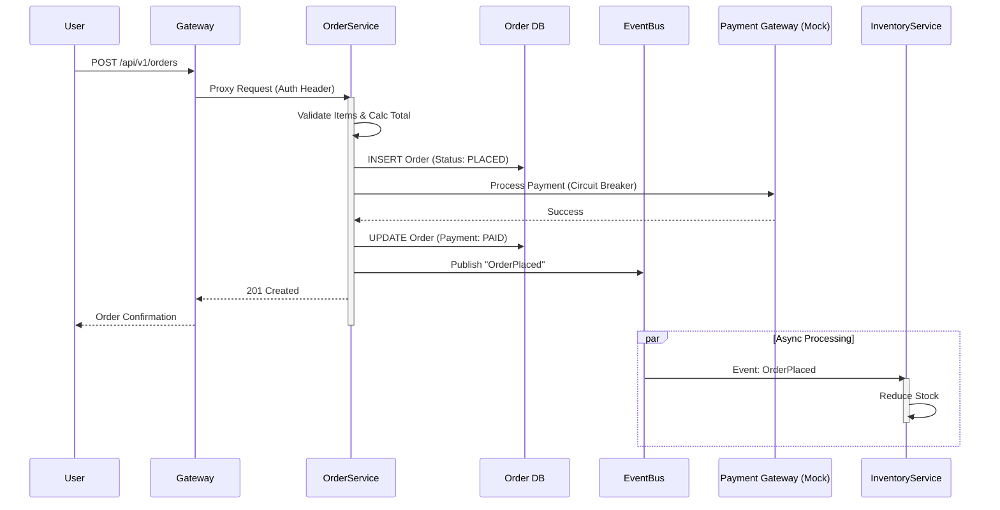

# System Architecture

This document describes the high-level architecture, data flows, and cloud infrastructure of the CloudRetail platform.

## 1. High-Level Service Map

The system follows a microservices architecture pattern utilizing a central API Gateway for routing and cross-cutting concerns (Auth, Rate Limiting).

```mermaid
graph TD
    Client[Client (React Frontend)]
    Gateway[API Gateway (Express)]
    Auth[Auth Service]
    Product[Product Service]
    Order[Order Service]
    Inventory[Inventory Service]
    
    MySQL[(MySQL Cluster)]
    EventBus{Event Bus (EventBridge)}

    Client -->|HTTPS/REST| Gateway
    Gateway -->|/auth| Auth
    Gateway -->|/products| Product
    Gateway -->|/orders| Order
    Gateway -->|/inventory| Inventory

    Auth --> MySQL
    Product --> MySQL
    Order --> MySQL
    Inventory --> MySQL

    Order -->|OrderPlaced| EventBus
    EventBus -->|Consume| Product
    EventBus -->|Consume| Inventory
```

## 2. Critical Data Flow: Order Creation

This flow demonstrates the distributed nature of the system, involving synchronous REST calls and asynchronous event propagation.



## 3. Cloud Services Map

Mapping of logical components to AWS Cloud Infrastructure services.

| Logical Component | AWS Service | Purpose |
| :--- | :--- | :--- |
| **Frontend/Static Assets** | **S3 + CloudFront** | Hosting React app build assets with low latency delivery. |
| **API Gateway** | **ECS / ALB** | Application Load Balancer routes to Gateway Service container. |
| **Microservices** | **ECS Fargate** | Serverless container execution for Auth, Product, Order, Inventory. |
| **Database** | **Aurora Serverless (MySQL)** | Auto-scaling relational database v2. |
| **Event Bus** | **EventBridge** | Serverless event bus for asynchronous service decoupling. |
| **Secrets** | **Secrets Manager** | Secure storage for DB credentials and API keys. |
| **Monitoring** | **CloudWatch** | Centralised logging and metrics aggregation. |
