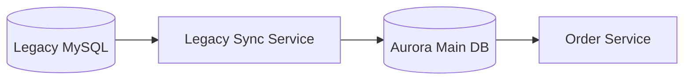

# Legacy Synchronization & Infrastructure Migration Guide

This document explains the strategy and technical implementation for integrating the legacy monolith database (`cloudretail_legacy`) with the new microservices architecture (`cloudretail_main`).

## 1. Context
The business is transitioning from a legacy monolithic MySQL database to a decoupled microservices architecture. To ensure business continuity, data from the legacy system must be synchronized into the new platform using an **Eventual Consistency** pattern.

## 2. Sync Architecture
The `legacy-sync-service` acts as a data bridge between the old and new worlds.



## 3. Implementation Details
The sync is performed by the `syncLegacy.js` script, which accomplishes the following:
1.  **Extraction**: Connects to the legacy RDS instance and reads historical orders.
2.  **Transformation**: Normalizes legacy currency formats and status codes to match the new microservices schema.
3.  **Loading**: Batch inserts the data into the main Aurora cluster.

## 4. Operational Steps
To perform a manual sync, ensure your `.env` file contains credentials for both databases:

```bash
cd legacy-sync-service
npm install
node syncLegacy.js
```

## 5. Architectural Principles
- **Idempotency**: The script is designed to be re-run without creating duplicate records in the main database (using `INSERT IGNORE` or unique constraints).
- **Asynchronous Flow**: This sync occurs out-of-band, ensuring that the primary microservices performance is not impacted by legacy database latencies.
